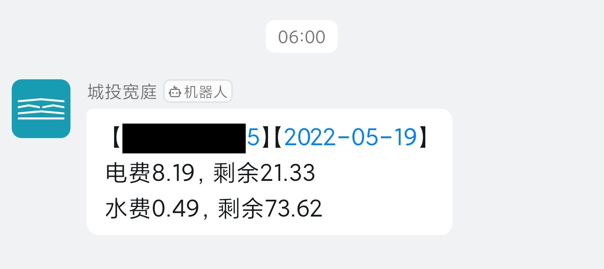
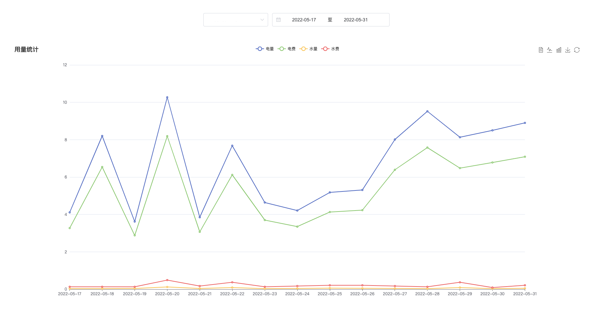

# Creative Apartment （城投宽庭）


每日运行收集电费、水费相关数据。

## Usage

```
Usage:
  creative-apartment [flags]

Flags:
      --debug           (env: SCA_DEBUG) show debug information
  -h, --help            help for creative-apartment
      --path string     (env: SCA_PATH) configuration file path
      --port int        (env: SCA_PORT) http server port (default 8089)
      --secret string   (env: SCA_SECRET) http server login secret
      --startup         (env: SCA_STARTUP) execute jobs at startup
  -v, --version         version for creative-apartment
```

### Docker


```bash
docker pull starudream/creative-apartment
```

```bash
mkdir -p /opt/docker/creative-apartment

docker run -d \
    --name creative-apartment \
    --restart always \
    -p 8089:8089 \
    -e SCA_DEBUG=true \
    -e SCA_PATH=/data/creative-apartment.yaml \
    -v /opt/docker/creative-apartment:/data \
    starudream/creative-apartment
```

```yaml
  sca:
    image: starudream/creative-apartment
    container_name: creative-apartment
    restart: always
    ports:
      - 8089:8089
    volumes:
      - /opt/docker/creative-apartment:/data
    environment:
      SCA_DEBUG: "true"
      SCA_STARTUP: "true"
      SCA_PATH: /data/creative-apartment.yaml
```

## Configuration

### Before

如何获取登录用户的 `token`，首先可以使用登录接口，使用短信验证码、手机号、密码进行登录。

但是宽庭是单点登录，所以无法同时运行该程序和手机客户端。

所以最好采用的是抓包，使用 `BlackBox` `TrustMeAlready` `VNET` 工具，抓包获取 `access_token`。

可以参考文章 [无 Root 抓包 HTTPS 请求](https://blog.starudream.cn/2022/05/09/android-packet-capture-without-root/)

获取到的 `access_token` 只有 `30天` 有效期，而且安卓包内没有刷新机制，所以需要每隔 `30天` 重新获取一次。

做自验证登录的话，因为每次都需要手机验证码所以会比较麻烦，暂时不会考虑了。

请求包可查看 [获取验证码及登录](./docs/login.md) 这篇文档。

### Path

The configuration file is read sequentially from the following paths:

- `${EXECUTED_PATH}/creative-apartment.yaml`
- `${HOME}/creative-apartment.yaml`
- `${HOME}/.config/starudream/creative-apartment.yaml`
- `${SCA_PATH}`

### Environment Variables

Each variable is preceded by a `SCA_` prefix

| Variable        | Type   | Default | Description              |
|-----------------|--------|---------|--------------------------|
| LOG_LEVEL       | STRING | INFO    | log level                |
| DEBUG           | BOOL   | FALSE   | show debug information   |
| PATH            | STRING | -       | configuration file path  |
| PORT            | INT    | 8089    | http server port         |
| SECRET          | STRING | -       | http server login secret |
| STARTUP         | BOOL   | FALSE   | execute jobs at startup  |
| DINGTALK_TOKEN  | STRING | -       | dingtalk robot token     |
| DINGTALK_SECRET | STRING | -       | dingtalk robot secret    |

- `LOG_LEVEL`: `trace`, `debug`, `info`, `warn`, `error`, `fatal`, `panic`

### Example

```yaml
customers:
  - phone: "${PHONE}"
    token: "${ACCESS_TOKEN}"
dingtalk:
  secret: "${DINGTALK_SECRET}"
  token: "${DINGTALK_TOKEN}"
secret: "${SECRET}"
```

## Screenshot

### 钉钉通知



### 网页查询



## License

[Apache License 2.0](./LICENSE)
